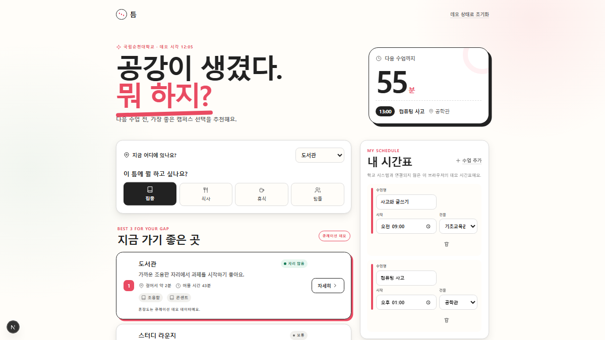

# 틈 (TEUM)

> 공강이 비는 시간이 아니라, 나를 위한 시간이 되도록 — 다음 수업 전 가장 좋은 캠퍼스 선택을 추천하는 서비스, 틈.



`틈`은 다음 수업까지 남은 시간, 현재 건물, 지금의 목적을 함께 고려해 순천대학교 캠퍼스에서 머물기 좋은 장소를 추천하는 모바일 웹 서비스입니다. 시간표를 편집하고 `집중`, `식사`, `휴식`, `팀플` 중 하나를 고르면 이동 시간과 공간 특성을 반영한 추천 이유를 확인할 수 있습니다.

## 주요 기능

- 다음 수업까지 남은 시간과 이동 여유를 함께 계산
- 목적에 맞는 캠퍼스 장소 3곳과 추천 이유 제시
- 현재 건물, 시간표를 브라우저에서 직접 수정
- 정적 캠퍼스 도식과 예상 도보 시간으로 이동 흐름 안내
- `자리 많음`, `보통`, `혼잡함` 제보를 이 기기에 저장하고 초기화

## 로컬 실행

Node.js 22 이상이 필요합니다.

```bash
npm install
npm run dev
```

브라우저에서 `http://localhost:3000`을 열면 12:05 도서관, 13:00 공학관 수업을 기준으로 한 데모를 바로 체험할 수 있습니다.

검증 명령은 다음과 같습니다.

```bash
npm run lint
npm run test
npm run build
npx playwright test
```

## 데이터 안내

이 프로젝트는 국립순천대학교의 공식 실시간 서비스가 아닙니다. 장소명과 기본 혼잡도는 공개된 캠퍼스 정보를 참고해 구성한 제출용 큐레이션 데모 데이터이며, 학교 내부 API·SSO·개인정보·실시간 위치를 사용하지 않습니다. 사용자가 입력한 시간표, 현재 건물, 혼잡 제보는 서버로 전송되지 않고 해당 브라우저의 로컬 저장소에만 남습니다.

- 캠퍼스 위치 참고: [국립순천대학교 공식 캠퍼스맵](https://www.scnu.ac.kr/SCNU/campus/kakao/view.do)
- 서비스 기획 및 데이터 범위: [SERVICE_PLAN.md](SERVICE_PLAN.md)

## 제출 정보

- 프로젝트 링크: [https://gap-rose.vercel.app](https://gap-rose.vercel.app)
- 발표자료: [docs/submission/teum-presentation.pdf](docs/submission/teum-presentation.pdf)
- 해시태그: `#대학생활` `#공강` `#캠퍼스라이프` `#시간관리` `#공간추천`
